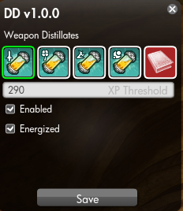

  
# DistillateDeleter
Mod for automatically deleting distillates and other items  
  
Last tab has a list where you can put any item (name or itemID) that should also be deleted (assuming they are deletable).  
If you are feeling adventurous you can also use wildcards `*`(any amount of characters) and `?`(any single character)  
To help avoid any accidents you can test your custom filters at https://secretfox.github.io/DistillateDeleter/  

By default the mod will run on safemode, and only prints a system chat message when it thinks item should be deleted, once you are happy with the settings you can run `/option DD_SafeMode 1`  to enable item deletion  

## Options  
`/option DD_Open true`  Opens config menu for the mod  
`/option DD_SafeMode false`  Disables safemode so items actually get deleted  

## Install  
Download from the releases page (link at the top), and unzip to `SWL\Data\Gui\Custom\Flash`  
